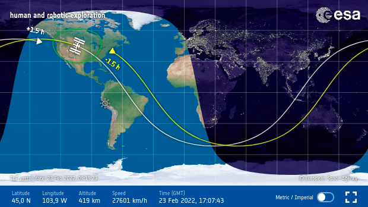
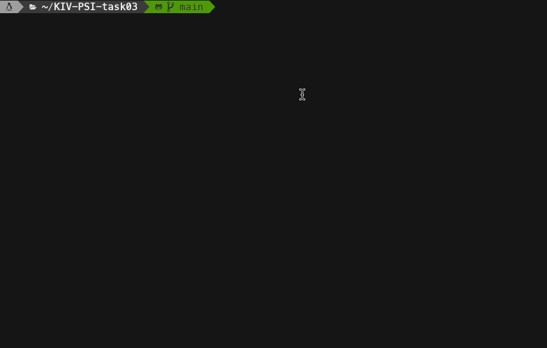
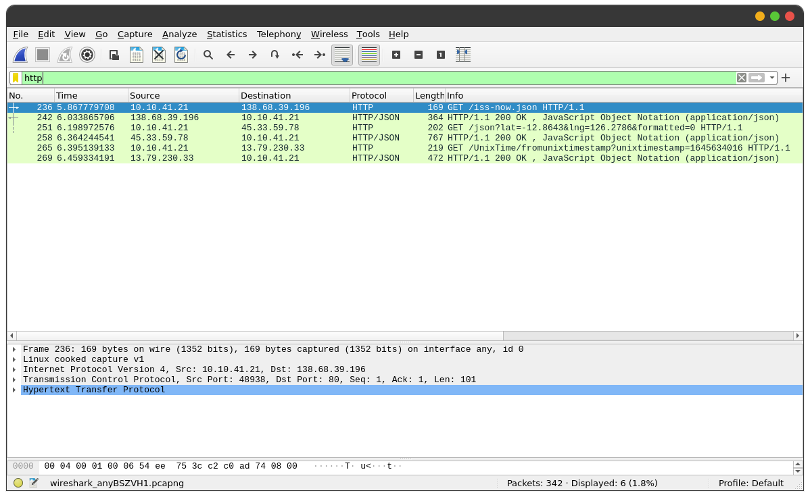

# KIV/PSI task 03 - REST client

This project implements a simple REST API client that fetches information about the current position (latitude, longitude) of the International Space Station (ISS). As required, the program also prints out if the ISS is currently in daylight and whether it's the perfect time for its observation from Earth.




The perfect time to observe the ISS fly by is 1-2 hours after sunset or 1-2 hours before sunrise. You can also see the current position of the ISS over at https://spotthestation.nasa.gov/tracking_map.cfm. 

## Used APIs

The program uses the following APIs:

- http://open-notify.org/Open-Notify-API/ISS-Location-Now/ (info about the ISS)
- https://sunrise-sunset.org/api (sunrise/sunset based on latitude and longitude)
- https://unixtime.co.za/ (conversion of datetime formats)


## Build

### Requirements

In order to successfully compile the application, you're required to have `cmake` installed on your machine. Additionally, this application runs on **Linux only**. To install `cmake` on a debian-based distribution, you can simply run the following command.

```bash
sudo apt-get install cmake
```

### Compilation

Once you have installed `cmake` on your machine, clone this project and navigate into the root folder of the project structure. Here, you're required to run the following sequence of commands.

```bash
mkdir build && cd build && cmake .. && make
```

Upon successful execution, a file called `kiv-psi-task03-silhavyj` should be created. This file represents the executable binary of the application.


### External libraries

As for external libraries, I decided to use the https://github.com/nlohmann/json library for JSON parsing. Also, I used the https://github.com/HowardHinnant/date library for datetime arithmetics. Both are header-only libraries statically linked to the executable file.

## Execution

The application doesn't take any parameters from the terminal. All you're required to do is to execute the following command

```bash
./kiv-psi-task03-silhavyj
```

If all went well, you'll be given the following output.

```
Information about the International Space Station (ISS)
-------------------------------------------------------
latitude: -11.8187
longitude: 76.4382
last update: 2022-02-24 08:56:36 (UTC)
ISS is currently in light
abs diff from sunrise (hours): 8.02833
abs diff from sunset (hours): 4.39

It's NOT the perfect time to observe the ISS fly by :(
You have to wait until it passes sunset (1-2 hours after the sun goes down)

You can verify the answers over at https://spotthestation.nasa.gov/tracking_map.cfm
```

If your internet connection is down, you'll be promoted with the following output.

```
Information about the International Space Station (ISS)
-------------------------------------------------------
ERR: could not establish connection with to server
ERR: no data has been received from the server
```

### Perfect time for observation
```
Information about the International Space Station (ISS)
-------------------------------------------------------
latitude: 44.3270
longitude: -53.7812
last update: 2022-02-24 08:22:35 (UTC)
ISS is currently in darkness
abs diff from sunrise (hours): 1.93694
abs diff from sunset (hours): 12.9194

It's the perfect time to observe the ISS fly by!

You can verify the answers over at https://spotthestation.nasa.gov/tracking_map.cfm
```

## Implementation details

The program makes 3 API calls in total. This was verified using the WireShark tool for sniffing packets.



The sequence of calls is to fetch down information about the current position of the ISS, use the information to find out the time of sunset/sunrise in that location, and covert the datetime into a unified format. If the timestamp of the ISS is in between the sunrise time and the sunset time in that location, the ISS is in daylight.